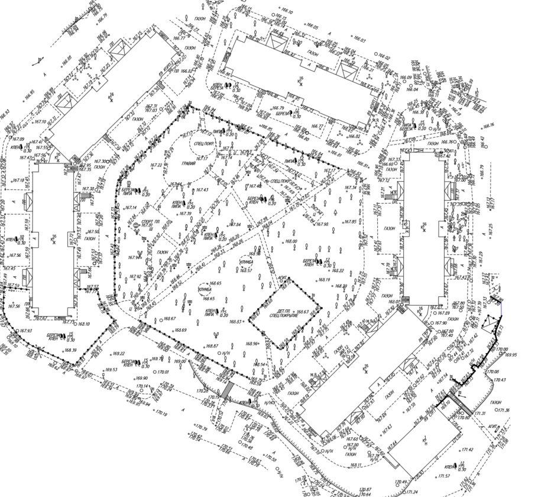
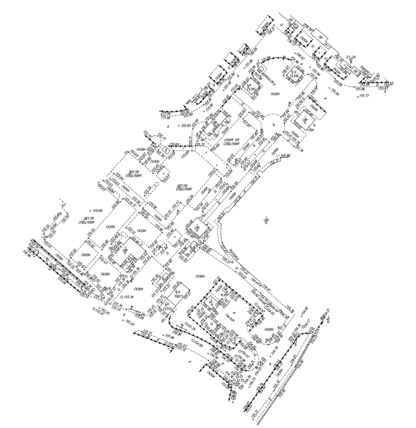
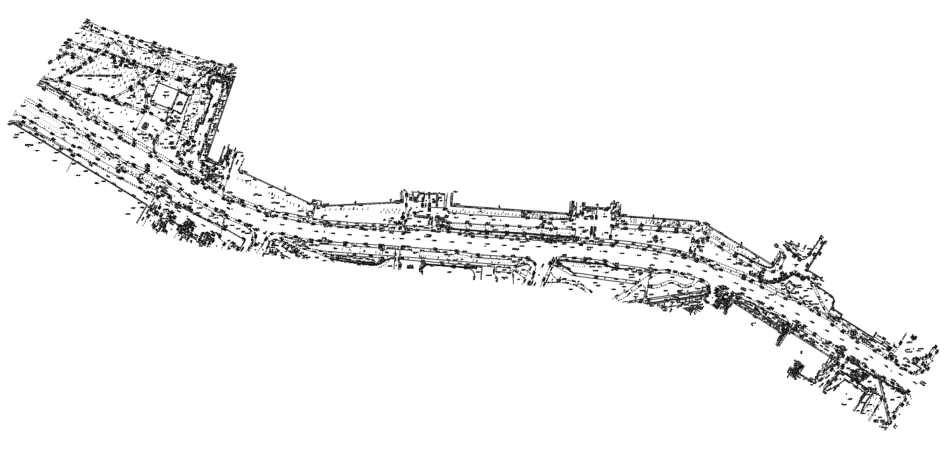

# PLAIN — Public Repository

> **Live service:** <https://plain-project.ru/>

PLAIN is a SaaS platform that automates the preparation of project documentation for urban planning, landscape architecture, and road infrastructure design. The service ingests source CAD drawings (DXF/DWG) and topographic surveys, recognises the semantic content of every drawing layer, and produces a complete set of derived documents — quantity takeoffs, existing-conditions plans, surface plans, vertical layouts, planting plans, urban-furniture plans, and specifications.

This repository is the **public, research-facing portion** of the project: it contains the data taxonomy, exploratory notebooks, training experiments, and benchmarks for the machine-learning component that powers automatic layer recognition. The proprietary SaaS backend that performs CAD generation, the production frontend, and the integration with object storage and personal-data audit logging are kept in a separate private repository.

---

## What the Service Does

A typical PLAIN session looks like this:

1. The user uploads two source files: a **topographic survey** and a **draft urban plan** (both as DXF/DWG).
2. The platform parses every drawing entity (`LINE`, `LWPOLYLINE`, `HATCH`, `CIRCLE`, `ARC`, etc.) and reads its layer name, type, embedded text and parent block name.
3. A fine-tuned NLP model assigns each entity a pair of semantic labels — a top-level category and a subcategory — drawn from a unified taxonomy (see [`data/CLASSES_STRUCTURE_EN.md`](data/CLASSES_STRUCTURE_EN.md)).
4. Downstream geometric routines use those labels to compute surface areas, linear lengths of curbs and edges, intersection geometries between the existing and proposed layouts, and so on.
5. The platform returns a complete set of drawings and tabular documents that would otherwise take engineering teams weeks to compile by hand.

PLAIN is operated by a private SaaS deployment at <https://plain-project.ru/> with user accounts, organisations, project versioning, and a 152-FZ-compliant audit log for personal data.

---

## What This Repository Contains

The repository focuses on the **layer-classification problem**, which is the foundation that makes everything downstream possible. In professional CAD practice, layer naming is wildly inconsistent across studios, regions, and projects — the same kind of object can appear under dozens of different names depending on local conventions, regulations, and personal habits of the designer. To turn a raw DXF into something a deterministic geometry engine can reason about, the platform first has to map every layer onto a stable semantic space.

The code and notebooks here cover:

- The full **two-level taxonomy** used by the classifier
- **Exploratory data analysis (EDA)** over the labeled corpora extracted from real-world drawings
- **Manual labeling workflows** in Jupyter notebooks
- **Six generations of model experiments** — from classical TF-IDF baselines to multilingual transformer encoders
- Per-class **evaluation metrics and reports**

What is intentionally **not** published here:

- The geometric routines that build the output drawings from the classified entities
- Trained model weights (these are versioned in the private repo and shipped to the production service)
- The web application code, database schema, and user-facing modules
- Raw DXF/DWG/PDF source files (gitignored — see [`.gitignore`](.gitignore))

---

## How the Classifier Works

Every entity in a DXF drawing exposes four textual signals: `Layer`, `Type`, `Text`, `BlockName`. The classifier concatenates these into a single input string and feeds it through a transformer encoder that emits two predictions in parallel:

- **L1** — 11 top-level categories (e.g. *Utility Networks*, *Landscaping*, *Hardscapes*)
- **L2** — 50–80 subcategories, chosen from the children allowed under the predicted L1 (e.g. *Storm Sewer*, *Trees*, *Paving Stones*)

A constraint mask guarantees that every predicted L2 label is consistent with its parent L1, ruling out impossible combinations. Three separate models are trained on disjoint data distributions — Moscow drawings, regional drawings, and design-stage plans — because the vocabularies and conventions diverge sharply between them.

**Example drawings the model processes:**

<p float="left">
  
  
  
</p>

---

## Taxonomy

The full taxonomy is defined in:

- [`data/CLASSES_STRUCTURE_EN.md`](data/CLASSES_STRUCTURE_EN.md) — English
- [`data/CLASSES_STRUCTURE_RU.md`](data/CLASSES_STRUCTURE_RU.md) — Russian

| L1 Category | Examples of L2 |
|---|---|
| Utility Networks | Water Supply, Storm Sewer, Power Supply, Heating Network |
| Topography | Contour Lines, Spot Elevations, Slopes |
| Hardscapes | Asphalt, Paving Stones, Granite, Concrete |
| Landscaping | Lawn, Trees, Shrubs, Flowerbeds |
| Site Furnishings | Playground Equipment, Fences, Street Furniture, Pavilions |
| Site Improvements | Curbs, Road Markings, Tactile Paving, Manholes |
| Buildings and Structures | Underground Structures, Bridges, Retaining Walls |
| Permeable Surfaces | Gravel, Sand, Wood Chips, Geomat |
| Service Layers | Cadastre, Red Lines, Title Block, Dimensions |
| Water Bodies | — |
| Unknown | — |

---

## Repository Structure

```
plain-public/
├── data/
│   ├── CLASSES_STRUCTURE_EN.md     # Taxonomy definition (English)
│   ├── CLASSES_STRUCTURE_RU.md     # Taxonomy definition (Russian)
│   ├── files/screenshots/          # Example DXF drawings (PNG previews)
│   ├── scripts/                    # CAD-export cleaning, area calculation, EDA helpers
│   ├── topography/                 # Topography corpus — EDA + manual labeling notebooks
│   └── urban_plans/                # Urban plans corpus — EDA, labeling, class distribution
├── models/
│   ├── first_experiments/          # Classical ML baselines and architecture probes
│   ├── v1.0/                       # rubert-tiny2 · baseline
│   ├── v2.0/                       # rubert-tiny2 · bug fixes
│   ├── v2.1/                       # rubert-tiny2 · full training run
│   ├── v3.0/                       # multilingual-e5-small experiment
│   └── v4.0/                       # xlm-roberta-base experiment
└── service/                        # Inference service (to be added)
```

### [`data/`](data/)

| Path | Description |
|---|---|
| [`data/CLASSES_STRUCTURE_EN.md`](data/CLASSES_STRUCTURE_EN.md) | Taxonomy — all L1 and L2 classes (English) |
| [`data/CLASSES_STRUCTURE_RU.md`](data/CLASSES_STRUCTURE_RU.md) | Taxonomy — all L1 and L2 classes (Russian) |
| [`data/files/screenshots/`](data/files/screenshots/) | Screenshots of representative source drawings |
| [`data/scripts/cad_codes_cleaner.ipynb`](data/scripts/cad_codes_cleaner.ipynb) | Cleanup of raw CAD-extracted records before labeling |
| [`data/scripts/calculate_area.py`](data/scripts/calculate_area.py) | Area-calculation helper used during EDA |
| [`data/scripts/eda.py`](data/scripts/eda.py) | Aggregate EDA over the cleaned corpora |
| [`data/topography/EDA.ipynb`](data/topography/EDA.ipynb) | Topography corpus — exploratory data analysis |
| [`data/topography/data_labeling.ipynb`](data/topography/data_labeling.ipynb) | Topography corpus — manual labeling workflow |
| [`data/urban_plans/EDA_and_labeling.ipynb`](data/urban_plans/EDA_and_labeling.ipynb) | Urban plans corpus — combined EDA and labeling |
| [`data/urban_plans/l1_distribution.csv`](data/urban_plans/l1_distribution.csv) | Class frequencies for the L1 level |
| [`data/urban_plans/l2_distribution.csv`](data/urban_plans/l2_distribution.csv) | Class frequencies for the L2 level |
| [`data/urban_plans/pair_distribution.csv`](data/urban_plans/pair_distribution.csv) | Joint frequencies of (L1, L2) pairs |
| [`data/urban_plans/translate_nb.py`](data/urban_plans/translate_nb.py) | Notebook translation helper |

### [`models/`](models/)

| Path | Backbone | Notes |
|---|---|---|
| [`models/first_experiments/`](models/first_experiments/) | TF-IDF + SGD | Classical ML baseline and architecture probes; cross-domain evaluation reports under [`baseline_reports/`](models/first_experiments/baseline_reports/) |
| [`models/v1.0/`](models/v1.0/) | `rubert-tiny2` | First transformer baseline ([`notebook`](models/v1.0/01a_rubert_tiny2_exp1_baseline.ipynb)) |
| [`models/v2.0/`](models/v2.0/) | `rubert-tiny2` | Bug fixes — separator, Unicode, empty fields ([`notebook`](models/v2.0/01b_rubert_tiny2_exp2_bugfixes.ipynb)) |
| [`models/v2.1/`](models/v2.1/) | `rubert-tiny2` | Full training run with class balancing and label smoothing ([`notebook`](models/v2.1/_01c_rubert_tiny2_exp3_full.ipynb)) |
| [`models/v3.0/`](models/v3.0/) | `multilingual-e5-small` | Multilingual encoder experiment ([`notebook`](models/v3.0/02_multilingual_e5_small_experiment.ipynb)) |
| [`models/v4.0/`](models/v4.0/) | `xlm-roberta-base` | Largest backbone tested ([`notebook`](models/v4.0/03_xlm_roberta_base_experiment.ipynb)) |

### [`service/`](service/)

A lightweight inference service that exposes the trained classifier behind a small HTTP API. It accepts a batch of CAD-entity records `{layer, type, text, block_name}` and returns the predicted `(L1, L2)` label pair along with confidence scores, ready to be consumed by the downstream geometric pipeline.

The service will be published in this directory shortly. It is intentionally kept minimal — model loading, batching, and prediction — so that it can be deployed independently of the main SaaS backend (for example, as a private inference endpoint behind a reverse proxy, or as a sidecar in the production cluster).

---

## Results

Final test-set metrics from [`models/v3.0/`](models/v3.0/) (`multilingual-e5-small`, ~118M parameters, hierarchical head with constraint-masked decoding):

| Source | Test rows | L1 macro F1 | L2 macro F1 | L2 weighted F1 |
|---|---|---|---|---|
| Moscow | 14 681 | **0.9985** | **0.9982** | **0.9987** |
| Regions | 14 729 | **0.9912** | **0.9901** | **0.9923** |
| Design plans | 9 650 | **0.9941** | **0.9896** | **0.9865** |

Hierarchical accuracy (both L1 *and* L2 correct simultaneously) on the same test sets: **0.9987** / **0.9922** / **0.9863** for Moscow, regions, and design plans respectively. Mean per-prediction confidence stays at ≥ 0.98 across all three sources, with the share of high-confidence predictions (≥ 0.85) exceeding 0.989 in every corpus.

Per-class precision / recall, confusion matrices, and side-by-side comparisons against the earlier experiments (TF-IDF baseline, `rubert-tiny2`, `xlm-roberta-base`) are available inside each experiment notebook under [`models/`](models/).

---

## Data Notes

Raw source files (`*.dxf`, `*.dwg`, `*.pdf`) are intentionally excluded from version control via [`.gitignore`](.gitignore). What is published here is limited to:

- Labeled CSV exports extracted from those drawings (one row per CAD entity)
- Jupyter notebooks for EDA, labeling, and model training
- Aggregated distribution CSVs and class-balance statistics
- Evaluation reports from training runs

If you would like to reproduce results on your own data, you can use the same `{layer, type, text, block_name}` record schema and follow the EDA / training notebooks step by step.

---

## Links

- 🌐 **Service:** <https://plain-project.ru/>
- 📚 **Taxonomy (EN):** [`data/CLASSES_STRUCTURE_EN.md`](data/CLASSES_STRUCTURE_EN.md)
- 📚 **Taxonomy (RU):** [`data/CLASSES_STRUCTURE_RU.md`](data/CLASSES_STRUCTURE_RU.md)
- 🧪 **Latest experiment:** [`models/v4.0/`](models/v4.0/)
